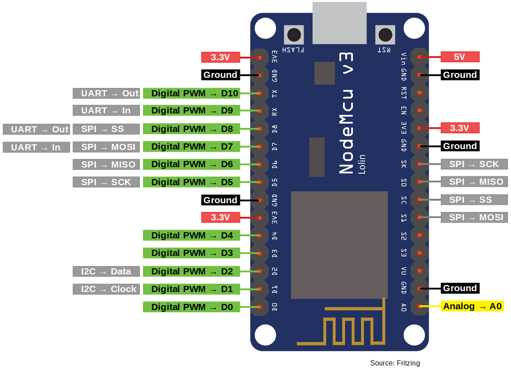

# Node Hardware

## Prototyping
In order to develop the node firmware and server software I used a breadoard prototype.
It is comprised of:

* Arduino nano IOT (see bellow)
* Some sensors (selected based on other similar projects.)
	* BME680
	* CCS811
	* SDS011
* A SD card module + 16GB SD card
	* The sd card might be quite overkill but well it was cheap and I had no idea how much data I would need to store when I ordered...
* A GPS module (GY-NEO6MV2)
	* Used for position measurement in a mobile system.
	* Used for clock synchronisation in absence of internet access.
* A small oled screen.
	* Used for debug and for user interface.
	* Not strictly required from the requirements but I though it would be nice to see the measurement in real time.
* A RTC module.
	* This was a it of a mistake since I forgot I could get the clock from the GPS...

### MCUs
I have three MCU for this prototype. 
The reason is that I had a arduino nano on my desk.
However, I want to make this into a cheap system and the arduino is FAR from cheap.
Thus I went for a NodeMCU(ESP8266), which is quite a lot cheaper for similar specs.
I also got its younger brother the ESP-WROOM-32 , a bit more expensive but with far more computation power + embedded bluetooth.
I will start with the arduino and switch to the other when they get here...
I would also like to try a few diferent MCU to see which hold best against cold temperature.

#### Arduinot nano IOT 
It is an arduino :) .

* SAMD21 Cortex®-M0+ 32bit low power ARM MCU
	* [Datasheet](https://content.arduino.cc/assets/mkr-microchip_samd21_family_full_datasheet-ds40001882d.pdf)
* RF: u-blox NINA-W102
	* [Datasheet](https://content.arduino.cc/assets/Arduino_NINA-W10_DataSheet_%28UBX-17065507%29.pdf)
* IMU: LSM6DS3
	* [Datasheet](https://content.arduino.cc/assets/st_imu_lsm6ds3_datasheet.pdf)
* Crypto: ATECC608A
	* [Datasheet](https://content.arduino.cc/assets/microchip_atecc608a_cryptoauthentication_device_summary_datasheet-DS40001977B.pdf)

#### NodeMCU V3
It not an arduino :) .

* ESP8266 does it all.
	* [Datasheet](https://www.espressif.com/sites/default/files/documentation/0a-esp8266ex_datasheet_en.pdf)

#### ESP-WROOM-32

* [Datasheet](https://www.espressif.com/sites/default/files/documentation/esp32-wroom-32d_esp32-wroom-32u_datasheet_en.pdf)

### Sensors

#### BME680
Primary sensor of the system.
This guy could be replaced by a BME280 to cut cost (if the air quality measurement is deamed useless).

* Sense:
	* Index of air quality (IAQ) from 0 to 500. (If I find some code to compute it...)
	* Temperature from -40 °C to 86 °C ±1 °C.
	* Pressure from 300 to 1100 hPa ±0.6 hPa.
	* humidity from 0 to 100 %r.H ±3 %r.H.
		* Valid for 0°C to 65°C.

* [Datasheet](https://www.bosch-sensortec.com/media/boschsensortec/downloads/datasheets/bst-bme680-ds001.pdf)

#### CCS811
* Sense:
	* equivalent CO2 (eCO2) from 400ppm up to 29206ppm.
	* equivalent Total Volatile Organic Compound (eTVOC) from 0ppb up to 32768ppb.
	* Can include a temperature and humidity compensation.
* [Datasheet](https://www.mouser.fr/datasheet/2/588/CCS811_DS000459_7-00-1594304.pdf)

#### SDS011
Particulate matter sensor.

* Sense:  
	* PM2.5 and PM10 from 0.0-999.9 μg/m3
	* __Unreliable for RH > 80% -->[paper](https://www.researchgate.net/publication/330544166_Performance_Assessment_of_a_Low-Cost_PM25_Sensor_for_a_near_Four-Month_Period_in_Oslo_Norway)__
* [Datasheet](https://cdn-reichelt.de/documents/datenblatt/X200/SDS011-DATASHEET.pdf)

### BOM
* In hindsight I totaly got ripped-off for the shipping of the RTC module. (I noticed it when doing this doc.)
* The total might be a bit off I rounded some values. 

| Part Name            | Type             | Unit Price (€) | Shipping cost (€) | Merchant                                                                                           |
|----------------------|------------------|----------------|-------------------|----------------------------------------------------------------------------------------------------|
| Arduino nano IOT     | MCU              | 18 + 4.15      | 5.5               | [arduino store](https://store.arduino.cc/arduino-nano-33-iot-with-headers)                         |
| NodeMcu V3           | MCU              | 1.92           | 0.6               | [aliexpress](https://fr.aliexpress.com/item/32665100123.html?spm=a2g0s.9042311.0.0.27426c37SSNlwU) |
| ESP-WROOM-32         | MCU              | 3.5            | 2               | [aliexpress](https://fr.aliexpress.com/item/32665100123.html?spm=a2g0s.9042311.0.0.27426c37SSNlwU) |
| WAVGAT GY-NEO6MV2    | GPS module       | 2.92           | 0.5               | [aliexpress](https://fr.aliexpress.com/item/32836015224.html?spm=a2g0s.9042311.0.0.27426c37SSNlwU) |
| WAVGAT Micro-SD card | SD card module   | 0.36           | 0.5               | [aliexpress](https://fr.aliexpress.com/item/32523546123.html?spm=a2g0s.9042311.0.0.27426c37SSNlwU) |
| DS3231 AT24C32 IIC   | RTC module       | 0.92           | 4                 | [aliexpress](https://fr.aliexpress.com/item/2037934408.html?spm=a2g0s.9042311.0.0.27426c37SSNlwU)  |
| Nova PM SDS011       | PM sensor        | 17.38          | 0                 | [aliexpress](https://fr.aliexpress.com/item/32617788139.html?spm=a2g0s.9042311.0.0.27426c37SSNlwU) |
| BME680               | TPH + gas sensor | 7.84           | 2                 | [aliexpress](https://fr.aliexpress.com/item/32961416338.html?spm=a2g0s.9042311.0.0.27426c37SSNlwU) |
| CCS811               | tcov/eCO2 sensor | 5.27           | 2                 | [aliexpress](https://fr.aliexpress.com/item/33058004405.html?spm=a2g0s.9042311.0.0.27426c37SSNlwU) |
| SanDisk A1 16GB      | 16GB SD card     | 3.5            | 1                 | [aliexpress](https://fr.aliexpress.com/item/32984767921.html?spm=a2g0s.9042311.0.0.27426c37SSNlwU) |
| 0.96" oled screen    | oled screen      | 1.6            | 0.9               | [aliexpress](https://fr.aliexpress.com/item/32896971385.html?spm=a2g0s.9042311.0.0.27426c37SSNlwU) |
| USB charger 10W      | USB charger      | 0.96           | 0.7               | [aliexpress](https://fr.aliexpress.com/item/33047898868.html?spm=a2g0s.9042311.0.0.27426c37SSNlwU) |
| Total                |                  | 67.86          | 19.2              |                                                                                                    |

