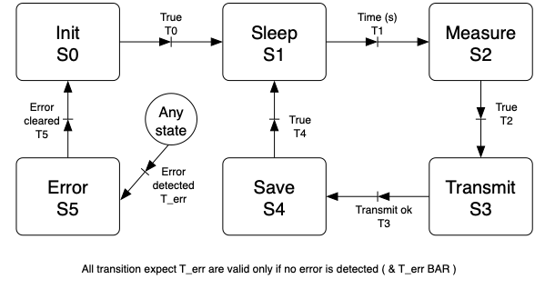

# Node Software
* The node software is written in C++.
* The node is controled by a simple state machine (see bellow).

## MK1 State machine
 {style="width:70%"}
  
**Figure 1:** Simple node state machine.

### States description
#### Init (state 0):
The state in which we initialise the system after powering-up.

* Read the config file in the external memory (SD card)
* Configure the system based on the config file
	* Set the wireless connection variable
	* If the file/sd-card is absent trigger a config-file error and go to the error state. 

#### Sleep (state 1):
The state in which we sleep until it is time to measure.

#### Measure (state 2):
The state in which we perfom the measurements.

#### Transmit (state 3):
The state in which we transmit the measured data to the server.

#### Save (state 4):
The state in which we save the measured data to the external memory.

#### Error (state 5):
The default state where we handle all systen breaking error detected by the system.
For now i am not sure if I need this bbut well better safe than sorry...

### Implementation
Pretty much stolen from [this](https://aleksandrhovhannisyan.github.io/blog/dev/finite-state-machine-fsm-tutorial-implementing-an-fsm-in-c/) example.
I guess I could have done it with just a 'switch', but I wanted to learn a OOP way of doing state machine, so I went for the aforementioned one.
